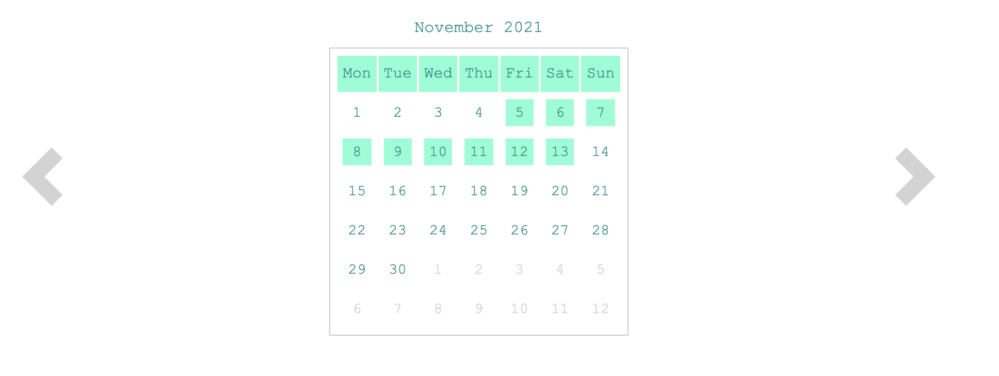
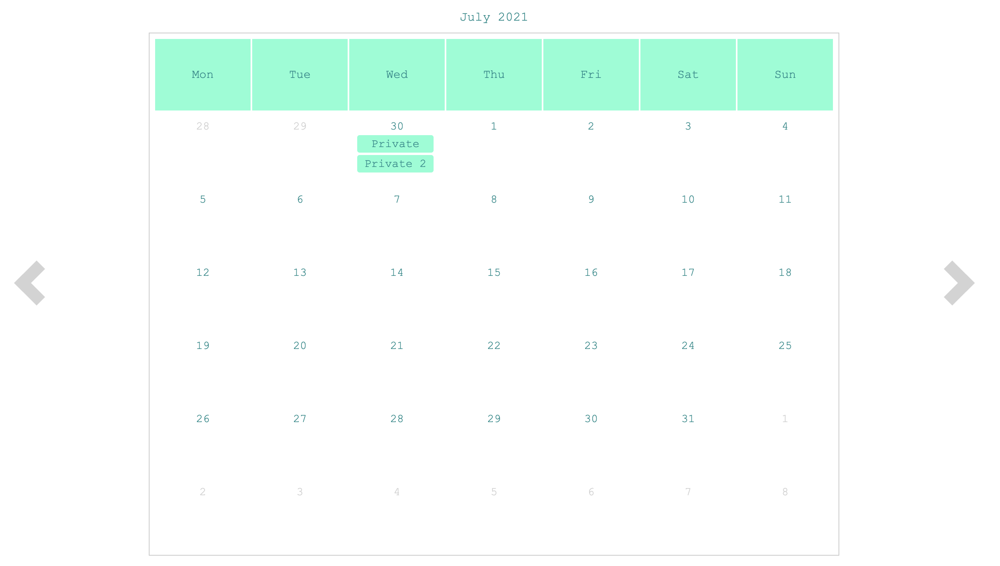

[](https://github.com/ToniRoos/very-simple-calendar/actions/workflows/main.yml)
# Very simple calendar

Should be a very simple react based calendar to show occupied states or just even events.

No matter if small...


...or big calendar, to show occupied states or to show events, use it as you want. 


## Install

```sh
npm i git+https://github.com/ToniRoos/very-simple-calendar.git
```

## Run examples

To run the examples on a local server, call the following commands.

```sh
npm install
npm run examples
```

## Usage
Simple example of usage:
```tsx
import { Calendar } from "very-simple-calendar";

export const App = () => {

    let events: CalendarEvent[] = [
        { startDate: new Date("2021-11-05"), endDate: new Date("2021-11-11") },
        { startDate: new Date("2021-11-05"), endDate: new Date("2021-11-07") },
        { startDate: new Date("2021-11-07"), endDate: new Date("2021-11-14") },
        { startDate: new Date("2021-06-30"), description: "Private" },
        { startDate: new Date("2021-06-30"), description: "Private 2" }
    ];

    return <div>
        <Calendar events={events} />
    </div>
}
```
Example for big calendar:
```tsx
export const App = () => {

    let events: CalendarEvent[] = [
        { startDate: new Date("2021-11-05"), endDate: new Date("2021-11-11") },
        { startDate: new Date("2021-11-05"), endDate: new Date("2021-11-07") },
        { startDate: new Date("2021-11-07"), endDate: new Date("2021-11-14") },
        { startDate: new Date("2021-06-30"), description: "Private" },
        { startDate: new Date("2021-06-30"), description: "Private 2" }
    ];

    return <div>
        <Calendar events={events} options={{
            type: CalendarType.big
        }} />
    </div>
}
```
------
## API

```tsx
export const App = () => {

    return <div>
        <Calendar startDate={...} events={...} options={...} eventConditionParser={...} />
    </div>
}
```

### Basic API

```startDate?```: ```Date``` (default: today | example: new Date(2021, 0, 5))

```events```: ```CalendarEvent[]``` (list of calendar events  to show)<br>
 - ```CalendarEvent```: (used to describe an event)
    - ```startDate```: ```Date```
    - ```endDate?```: ```Date```
    - ```description?```: ```string```
    - ```id?```: ```string``` (can be used to identify events, for example to group events)

```options?```: ```CalendarDataOptions``` (display options)
 - ```monthNames?```: ```string[]``` (default: ["January", "February", ..., "December"])
 - ```weekDayNames?```: ```string[]``` (default: ['Mon', 'Tue', ..., 'Sun'])
 - ```shiftWeekStartDay?```: ```number``` (default: 0 => means starting week on monday, use -1 to start week on sunday)
 - ```numberCalendarsToShow?```: ```number``` (number of pages to show)
 - ```type?```: ```CalendarType``` (small | big)

```calendarDayFormatter?``` (define the style of a week day cell by giving you the events of the day)
 -  validateEventsOfDay: (active: boolean, day: Date, eventsOfDay: CalendarEvent[]) => CalendarDayDescriptor

### Advanced API

```options?```: ```CalendarDataOptions``` (display options)
 - ```calendarDayContent?```: ```({ day: Date, active: boolean, eventsOfDay: CalendarEvents[], calendarDayFormatter: CalendarDayFormatter}) => JSX.Element | JSX.Element[]``` (create your custom week day content)
 ```options?```: ```CalendarDataOptions``` (display options)
 - ```calendarDayTemplate?```: ```({ day: Date, active: boolean, eventsOfDay: CalendarEvents[], calendarDayFormatter: CalendarDayFormatter}) => JSX.Element | JSX.Element[]``` (create your custom week day template)
