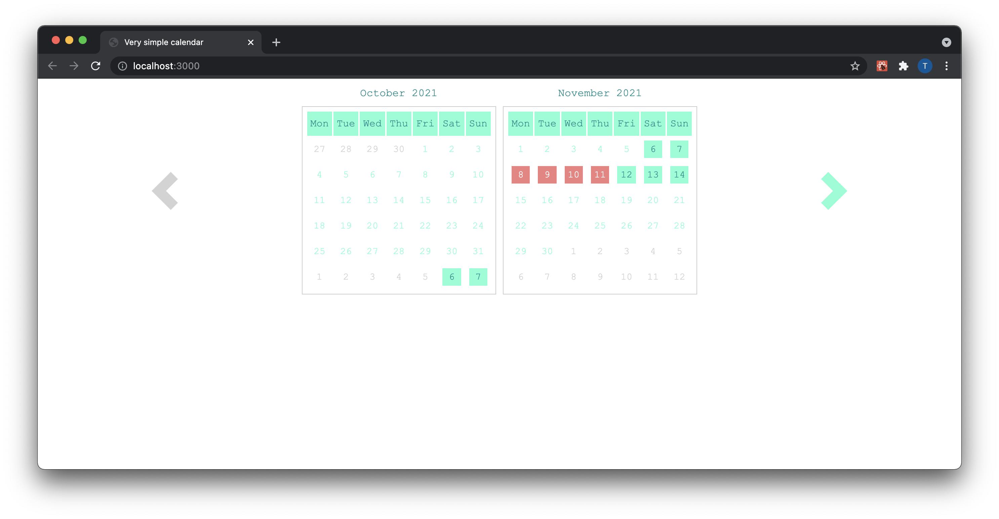

[](https://github.com/ToniRoos/very-simple-calendar/actions/workflows/main.yml)
# Very simple calendar

Should be a very simple react based calendar to show occupied states.



## Todo's
 [ ] enable possibility to use custom logic to render week day style


## 1. Build

Webpack will be used for compiling and bundling the source code. 

### 1.1 Production build

For a local production build, call the following command and the sources will be compiled to the "dist"-folder.

```sh
    npm run build
```

### 1.2 Development build

For a development build, call the following command and the sources will be compiled with a development server.

```sh
// uses local development server
npm run local
